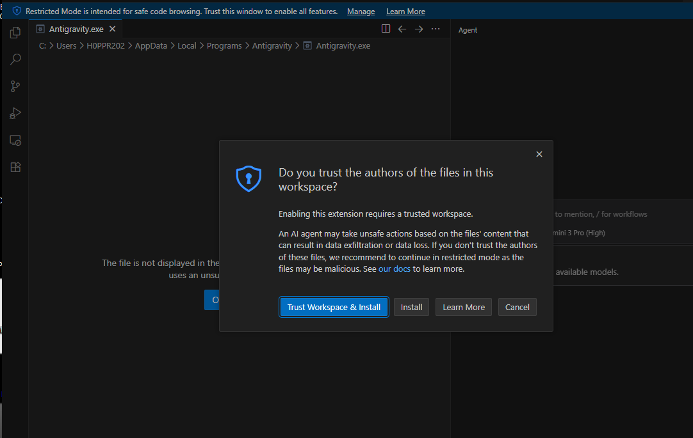
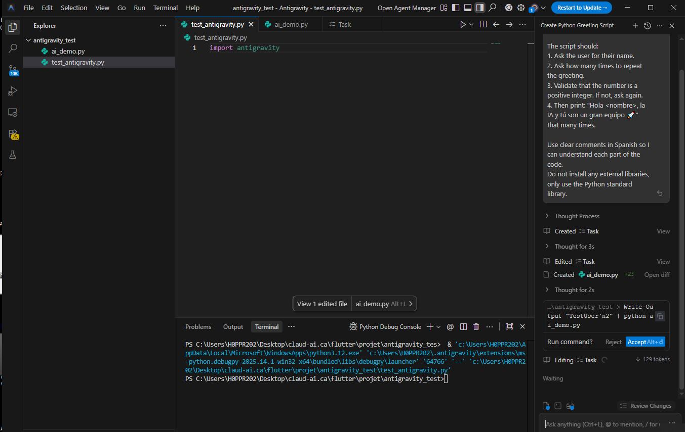
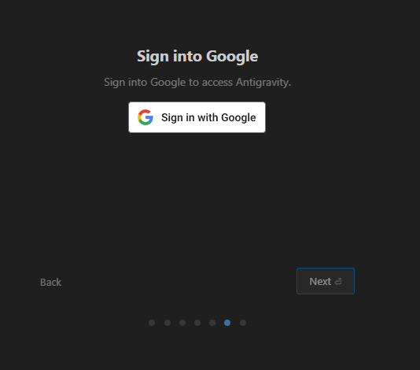
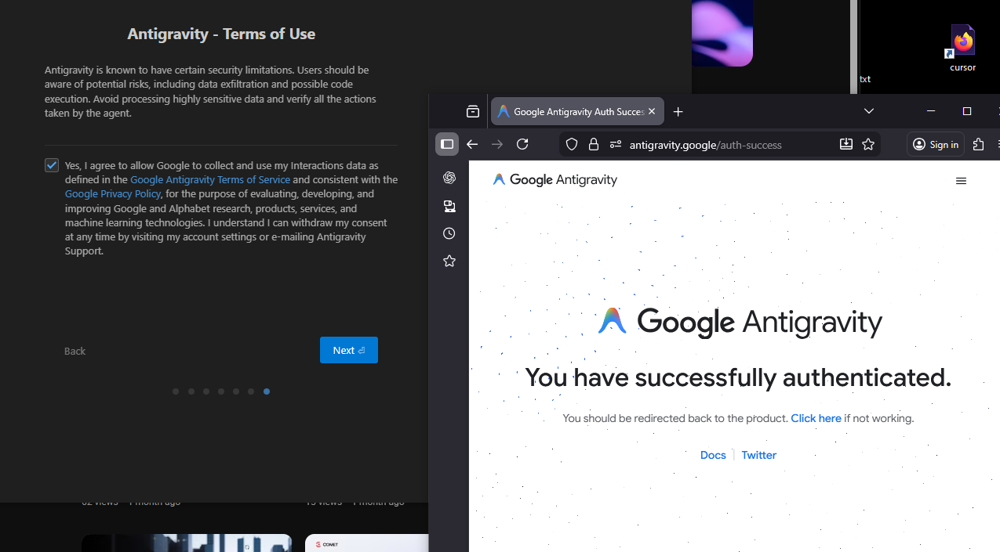

# 📘 Antigravity IDE + Python + IA — Tutorial Completo
*Proyecto educativo creado por Claud-IA*

Este repositorio contiene una guía **paso a paso** para:

- Configurar **Antigravity IDE** desde cero  
- Ejecutar el módulo secreto `antigravity`  
- Usar el **Antigravity Agent** para generar código dentro del IDE  
- Crear una demo interactiva de IA (`ai_demo.py`)  
- Solucionar errores reales que ocurrieron durante el proceso  

El objetivo es que cualquier persona pueda seguir este tutorial y recrear esta experiencia educativa.

---

# 🚀 1. Requisitos

- Windows 10/11  
- Python 3.x instalado  
- Antigravity IDE instalado  
- Cuenta de Google (para autenticación opcional)  

Verifica Python con:

```bash
python --version
```

---

# 🧩 2. Configuración inicial del IDE

## 2.1 Elegir modo de inicio  
✔ Seleccionar: **Start fresh**

---

## 2.2 Configurar el Antigravity Agent  

Configuración recomendada:

- Modo: **Custom configuration**
- Terminal execution policy: `Auto`
- Review policy: **Request Review** ✔
- JavaScript execution: `Always Ask`

---

## 2.3 Configurar el editor

- Keybindings: **Normal**  
- Install 7 Extensions: **✔**

---

## 2.4 Autenticación con Google (opcional)

Sigue el proceso de login hasta ver:  
**“You have successfully authenticated”**

---

## 2.5 Confiar en el workspace

✔ Selecciona: **Yes, I trust the authors**

---

## 2.6 Recargar el IDE (si aparece)

✔ Clic en **Reload Window**

---

# 📁 3. Crear el proyecto **antigravity_test**

1. En Antigravity → **Open Folder**
2. Crear carpeta:

```
antigravity_test
```

3. Abrirla y confiar nuevamente en el folder:

✔ **Yes, I trust the authors**

---

# 🐍 4. Probar Python con `antigravity`

Crear archivo:

```
test_antigravity.py
```

Contenido:

```python
import antigravity
```

Ejecutar:

- **Run Python File**  
- o **Run Without Debugging**

Esto debe abrir el cómic XKCD #353.

---

# 🤖 5. Demo IA dentro del IDE

## 5.1 Abrir el panel del Antigravity Agent

En la parte derecha:  
```
Ask anything (Ctrl+L)
```

---

## 5.2 Pedirle al agente que cree un archivo Python

Prompt usado:

```
Create a new Python file in this workspace called ai_demo.py.

The script should:
1. Ask the user for their name.
2. Ask how many times to repeat the greeting.
3. Validate that the number is a positive integer.
4. Print: "Hola <nombre>, la IA y tú son un gran equipo 🚀" that many times.

Use comments in Spanish.
Only use the Python standard library.
```

---

## 5.3 Código resultante (`ai_demo.py`)

```python
def main():
    nombre = input("Por favor, introduce tu nombre: ")

    while True:
        entrada = input("¿Cuántas veces quieres repetir el saludo? ")
        try:
            cantidad = int(entrada)
            if cantidad > 0:
                break
            else:
                print("Por favor, introduce un número entero positivo mayor que cero.")
        except ValueError:
            print("Eso no es un número válido. Inténtalo de nuevo.")

    for _ in range(cantidad):
        print(f"Hola {nombre}, la IA y tú son un gran equipo 🚀")


if __name__ == "__main__":
    main()
```

---

## 🧪 5.4 Ejecutar la demo

```bash
python ai_demo.py
```

Salida:

```
Por favor, introduce tu nombre: claudia
¿Cuántas veces quieres repetir el saludo? 3

Hola claudia, la IA y tú son un gran equipo 🚀
Hola claudia, la IA y tú son un gran equipo 🚀
Hola claudia, la IA y tú son un gran equipo 🚀
```

---

# ⚠️ 6. Errores reales y soluciones

## ❌ Error: Agent terminated due to error

Causa: comando generado automáticamente incorrecto.

Solución:  
✔ Dismiss  
✔ Ejecutar manualmente:

```bash
python ai_demo.py
```

---

## ❌ Error: UnicodeEncodeError (emojis)

Solución:

```bat
chcp 65001
python ai_demo.py
```

o usar la terminal integrada del IDE.

---

# 🎯 7. Resultado final

✔ IDE configurado  
✔ Python probado con `antigravity`  
✔ Agente funcionando  
✔ Demo de IA generada  
✔ Ejecución correcta  
✔ Errores resueltos

---

# 🔮 8. Próximos pasos

- Añadir soporte multilenguaje  
- Crear interfaz gráfica  
- Crear pruebas unitarias  
- Convertir la demo en API  
- Generar más código con el agente  

---
## 📸 Capturas reales del proceso

A continuación se muestran imágenes reales tomadas durante la instalación, configuración y pruebas del IDE Antigravity con IA integrada.

### 1. Inicio del Setup
<p align="center">
  
</p>

---

### 2. Selección de flujo de configuración
<p align="center">
  
</p>

---

### 3. Configuración personalizada del agente
<p align="center">
  
</p>

---

### 4. Keybindings y extensiones
<p align="center">
  
</p>

---

### 5. Login con Google
<p align="center">
  
</p>

---

### 6. Autenticación exitosa
<p align="center">
  
</p>

---

### 7. Términos de uso de Antigravity
<p align="center">
  
</p>

---

### 8. Trust Workspace
<p align="center">
  
</p>

---

### 9. Workspace cargado
<p align="center">
  <img

¡Proyecto listo para GitHub 🚀!
